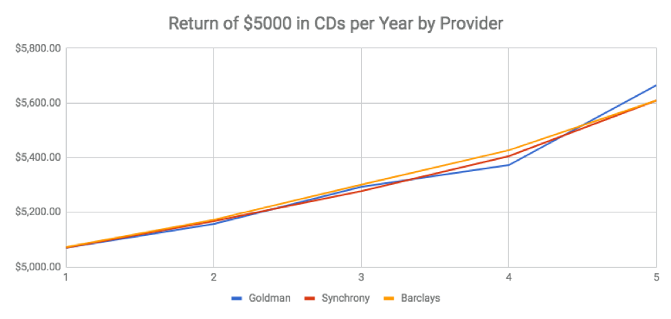

## Risk vs Reward vs Liquidity
Ok, so I over-simplified the risk vs reward tradeoff.  There is actually a third leg to the stool, and that’s liquidity.  How fast can you turn your asset into cash?   Although it’s not how a vast majority of these transactions actually go, I like to envision how quickly I could hold the amount in actual bills.  So, let’s look at that spectrum:

* Checking account:  I could go to the bank or even write a check.  
  * Time to cash:  5 minutes.  
  * Amount of interest normally paid:  0
* Savings account
  * Time to cash: A little longer than 5 minutes. Normally you can’t write a check out of it, so marginally longer than checking.
  * Amount of interest paid:  Marginally above 0.
* Certificate of deposit (CD):  Rates vary with the hold time, so we’ll come back to this.
* Public equities (aka stock market)  
  * Time to cash: Four days.  (Day to sell, 3 to get to bank in the US), then to cash.  
  * Amount of return:  Historically about 7%
* Real estate 
  * Time to cash:  Weeks.  Even with instant sale, the paperwork, funding is a few weeks.  
  * Amount of return:  Also, historically about 7% with less volatility.  

## Liquidity Premium Calculated from CD Rates

So then, what should the premium be for a rate of return versus the loss of liquidity?  It probably varies with the investment, but I decided to look at something I could effectively measure, and that was CDs.

If we assume that the market is efficient (you’ll just have to go with this, if you disagree), the fact that CDs are sold by many different companies with different hold periods and rates of return does allow me to estimate what that liquidity premium is.

So, I went online and gathered the period and rate of return for CDs across many providers.  

| Years | Average Rate of Return | Percentage Change from 1 year | Percentage Change Per Year / # of Years|
|---|---|---|---|
|1|1.46%|
|3|1.90%|30.14%|10.05%|
|5|2.25%|54.11%|10.82%|

### Summary
There appears to be about a 10% premium per year of hold time.  In other words, if you were going to get a 10% return for 1 year, for 2 years it’s likely you’d get 11% (10% of 10% is 1%, added to the existing 10%).

:::note
If you're asking yourself where you can get these awesome rates, or why these rates are so terrible, recognize they change over time and this is a snapshot from when I did this research.
:::
