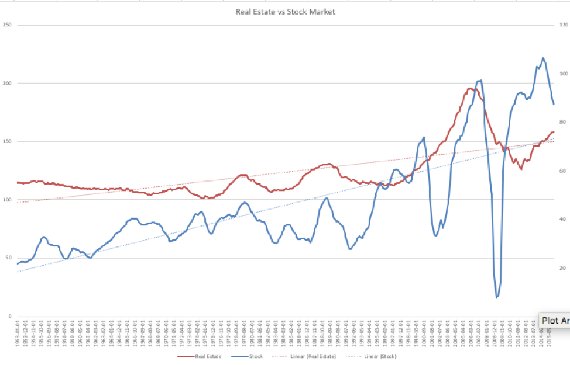

# Real Estate

## Correlation with [equities](equities.md). 

Some of the strongest held beliefs is that real estate
* Has a higher rate of return than equities
* Is more recession resistant 
* Does not correlate with the stock market

So, I got interested in real estate investing.  I’ll tell you right now, it’s a very complicated topic, and I’m going to spend a lot of time trying to explain it (which will be useful, because maybe then I’ll actually understand it).   But, I wanted to see if any of this held up in the data.

It turns out, finding data on these things for long periods of time, is kind of hard.  For the stock market, if you only use a market index, you lose the value of dividends, which really depresses its value.  For real estate, there are so many different varieties that haven’t all been around for long periods of time, so it’s nearly impossible to have a truly long-term view.  But, I made a credible attempt at it, and here is what I have:

### Data
* Stock market:  Good news here is that the economist Robert Shiller has done the heavy lifting here, so this data is available for a very long period of time. (Shiller, 2018)
** Problem with this data:  US equities only.  
* Real estate:  This is a hard problem, and in the end my best long-term data was for Single Family Homes (SFH), from Robert Shiller in his book, Irrational Exuberance. (Shiller, 2018)
** Problem with this data:  Well, it makes SFH a proxy for all types of real estate. It is likely not 100% true when compared with Commercial and Multi-Family Home (MFH) and Retail and … but it’s the best I could find.

### Result

There is a lot going on in this chart, so I’ll try to summarize:
* Solid red line: Real estate value
* Dotted red line:  Trend line showing the slope (and thus the rate of return)
* Solid blue line: Stock market value
* Dotted blue line:  You should be able to figure this out.

So, what does it tell us:
* Historical rate of return since 1890
* Stock market: 7.2%
* Real estate: 6.9%
* Correlation between stock market and real estate: .70 (strong correlation)
* Volatility:  Clearly much lower for real estate

So, clearly the conclusion is that you should not invest in real estate, right?

Not so fast.  This is one of those cases where it’s not a simple decision, so you’re going to have to put your thinking tuque on.

## Positives
* Diversification:  It is a very good idea to be diversified.  This has the effect of limiting your risk by spreading it across many asset classes.  I’ll discuss diversification in more detail.
* Taxes:  Real estate can have a very large tax advantage.  Generally speaking they can be income generating, but with depreciation, show appreciable tax losses.  So, if you’re in high tax brackets it can bump the effective return up dramatically.

## Negatives
* Complexity:  It’s a very complex asset class.  We’ve already talked about SFH, MFH, Commercial and Retail.  But even there, you get Mobile Home Parks (MHP), Self-storage, Apartments, Medical, … the list goes on and on.
* Deal flow:  In recent years the availability of crowd funding has helped here dramatically.  Before that you had no way to get access to real estate in any truly sustainable and diverse way.
* Capital:  The owners are paying you to use your capital, which means you need to provide it.  The minimum investments tend to be $10,000 and realistically tend to be $25,000 and up.
* Liquidity:  Hold times are normally longer than 5 years, so you have to realize you’re giving up access to that money for the entire time.
Uncertainty:  It’s a new asset class to you, and due to the long hold times, you can’t go ‘full cycle’ before investing more money.

## Taxes

I'm going to necessarily simplify this discussion.  Primarily because I'm a simpleton in the space, so can only talk to the pieces I *think* I understand.  There are several classifications of real estate, but I'm only going to discuss two for now (and really I'm skipping one of those):

* Active:  This is where you own the real estate and actively manage it.  You are responsible for finding tenants or hiring people to find them.  You have direct control of the assets.
* Passive:  You are a partner in a company that manages real estate.  Normally, as an investor, you are a Limited Partner (LP) in which the General Partner (GP) does the active portion.

I have no desire to do active management.  This can be lucrative (or not, like everything else) but the amount of time and energy it can end up taking is more than I'm willing to put into it.  Primarily because I have a day job and limited intellectual energy.  Look at that as more of a me problem. The result is that I'm not going to address this asset class.

Regardless, in both of these cases, the thing that makes real estate attractive is depreciation.  Depreciation is the amount of value something loses due to wear and tear or age.  Cars depreciate when you drive them off the lot.  Buildings depreciate the older they get, on the assumption that you're going to have to spend money fixing things.  Because of this, you end up having an asset that is (in theory) going down in value.  That loss of value you get to report on your taxes!  

Let's say you have an asset that is worth $100,000.  If it were to depreciate over the course of 27.5 years (don't ask me why that number), the loss per year (assuming linear depreciation) would be $3,636, which is a very satisfying number.  Now, assume that the property cash flowed positive.  In other words, people using the building were paying more that utilities, financing, any other expenses cost.  In our fictional world, we end up making $3,000 per year.  Now, we actually get that $3,000 and it is ours to spend.  But when it comes time to pay taxes we have:

* $3,000 in passive income
* $3,636 in deprecation expense
* ergo, we have *lost* $636

This is where the assumption that you can make money without paying taxes comes from.  **But** if you believe the government doesn't eventually get its money, you're crazy.  

First, you can't apply that loss to your income or other investment gains only against passive gains.  You can carry it forward however.  So, over the course of years you hope to gain significant passive loss, and in the future when the property sells for more than you paid (one of the reasons you invested) you can offset all of that gain with the accumulated passive loss.  Also, when you go to sell that property, you can buy a bigger property and roll your profits into it without paying taxes ( a.k.a. [1031 Exchange](https://www.investopedia.com/financial-edge/0110/10-things-to-know-about-1031-exchanges.aspx) ).

If at this point you're saying to yourself, "Self, this is crazy complex!"  You're right, so understand what you're getting into. 

**Summary** 

It is important to actually quantify this is real numbers and to take a shot at that I'm going to use the numbers I have laid out over in [Real Estate](realestate.md).

* Stock Market: 7.2%
* Real estate: 6.9%
* Difference: .3% absolute or a 4.3% percentage change.

So, if you have a tax rate above 4.3% (Hint: You probably do) choosing a rate of return of 6.9% on something with 0% taxes will net you more money.  At a 20% tax rate, to match the 6.9% net you need your return to get you 8.6%.

... but you're going to have to be willing to work harder to have real estate work for you.

## TBD
### Correlation between REIT and SFH
### K1s are going to complicate things

