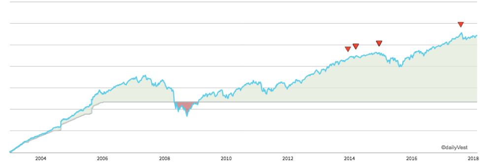

# What I Do

I know a lot of these discussions seem a little abstract, and it’s really easy to read what people say you should do, but what do they do, and does it work?  So, to that end, here is what I do.

## Investments

* I invest in modified Three Fund portfolios.  My modification on them is to replace the bond portion of the portfolios with a target date fund.  This has the net effect of making my investments more aggressive but trending towards more conservative.  This mirrors my general approach on things, which is more aggressive than most.
* My 401K is a Roth 401k.  I have discussion on the various trade-offs over in [retirement](retirement.md), but my primary reason is because I want to simplify retirement.  Even if the tradeoffs mean I would have been better off in a traditional 401k, I've eliminated complexity when I am retired on how I have to deal with the money.
* I have a handful of "passive" [real estate](realestate.md) investments.  
* I invest in traditional IRAs.

# What I'm Going to Do

* I expect over the next few years I will unwind all of the real estate because I don't see that the return is better than equities, the risk is higher, the liquidity is lower and it's not as interesting to me.
* I'm going to work on using "Backdoor Roths".  This takes some work given traditional IRAs, but shouldn't be that difficult, just tedious.  Google it to be even more confused than you expected.

# What I Did

* I used to have individual stocks.  I bought them nearly 20 years ago when I had the hubris to think that I could be good at picking stocks.  I finally liquidated all of them, and the results are about what you would expect.
  * I lost money outright on one.
  * I underperformed the broader market on all but one of the remaining.
  * I likely lost money due to the cost of inflation on most of them.
  * I crushed the market on one of them.

So, in summary, I had random results and had some good outcomes and bad outcomes, but the decision making process was suspect at best.

# Sample Results

I worked for a company from September of 2003 until May of 2006.  In that time, I contributed to my 401k, entirely into index funds.  (Maybe not the best ones, but we all learn).  I haven’t rolled this over to something else, so it provides a great view into a single long-term investment.

The thin line at the bottom is my total contributions.  The blue line at the top is total value of the portfolio.  The little red markers are when I made a change to allocations.

My cumulative personal return is just under 147%, which annualizes to 6.2%.  

You’ll notice that when the Great Recession hit in 2008, the value of the portfolio was actually worth less than the amount of money I had put in.  But, in less than 2 years it had recovered and it took nearly 6 years to recover to the highs of 2007, but it has continued to climb.

So, here is an actual example of how a long term buy and hold strategy for index funds works in the real world.

But how did I do compared to the S&P 500?  Well, good but not great?  From January of 2004 until March of 2018, S&P 500 total return was 139% with an annualized return of 6.3%.  So seems like I did pretty dang good!  What about with dividends reinvested?  217% and 8.5%, so maybe I didn’t do that great (S&P 500 Return Calculator, with Dividend Reinvestment, 2018).  I will say, I think part of it is because I didn’t have enough low cost, index funds, something I have slowly fixed in the last few years.  But, in spite of that, I have managed to at least pace the market, for this investment.
