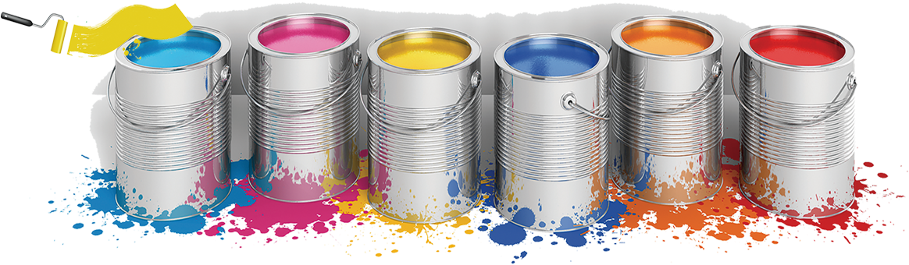

When you looking at your ability to save, you should try to fill these 'buckets', in this order.  It is well laid out in the [flowchart](spending.md) as well.

* [Emergency Fund](emergency.md) - Money to allow you to weather moderate disasters
* [Should I do a Roth](tvr) - Should you focus on pre-tax before post-tax? (tl;dr: No)
* [Pre-tax](pre-tax.md) - Money you can put away before the government taxes it
* [After-tax](after-tax.md) - It's already been taxed, but can grow tax free/deferred
* [Taxable](taxable.md) - The goverment has already taken their cut, and will in the future, but it can still grow

:::caution 
This focuses a lot on the tax treatment, because it represents a way to get better returns.  Do **NOT** take this as advice that you should actually focus on reducing taxes.  You should focus on [investing](investing.md) as much as you can.
:::  

:::note  
This is just the order to fill your 'buckets' in order to try to maximize your returns.
:::  

## Additional Reading
* [Reddit - The Prime Directive](https://www.reddit.com/r/personalfinance/wiki/commontopics?utm_content=t5_2qstm)
* [Bogleheads - Prioritizing Investments](https://www.bogleheads.org/wiki/Prioritizing_investments)
