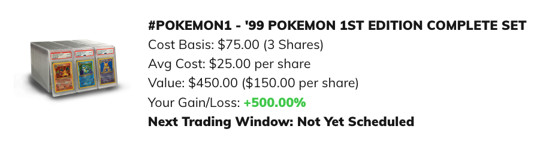

## Overview
Speculation is where you make money decisions, not based on rational decision making, but instead based on your beliefs or hopes.  And guess what?  That's O.K.

* Cryptocurrencies 
* Other

Now, sure, you can end up with some spectacular results, be recognize that it's luck, not skill.  Do this with the money ou can afford to lose.

## My best *"investment"* of 2020

Between June 26th and December 1st of 2020 I made 500% on a single *investment*.  And I don't really care.

What was that investment?  Pokémon cards.  No, I'm not kidding.

### 15 year old me

But, I want to call out why this is speculation and not investing.  A few years ago I heard somewhere about [Rally](https://rallyrd.com/).  Focused on collectible cars, they allowed you to purchase fractional shares of these cars.  If I were to be completely honest, the only reason I signed up is probably so I could fulfill every 90's boy dream of owning part of a [Lamborghini Countach](https://en.wikipedia.org/wiki/Lamborghini_Countach).  I can't convince myself to actually pay for a share because the price continues to plummet.  15 year old me can't convince adult rational me to let go.  Sad.

### Older me

However, Rally expanded into other memorabilia, so I will buy a single share of things that I have an emotional attachment to, or I think might make neat gifts for people.

As a result, I bought 3 shares of a complete 1st Edition Pokémon Card set.  One share for each of my children for $25 each.  I thought it would make fun certificates as birthday/Christmas presents.  

Then the trading started.  First trading they traded at $50 a share.  Then I got a buyout offer at $100 a share... *that got turned down*!  They last traded at $150/share or up 500%.

Now I have a real philosphical dilemma. 

* Do I gift my kids the shares, and suddenly they've made $125?
* But now I'm reinforcing speculation over investing.
* Do I hold the cash like some sort of Scrooge?

So far I haven't sold or told them about it.  If it keeps up at this rate maybe I'll sell so they can buy a single textbook in college.
